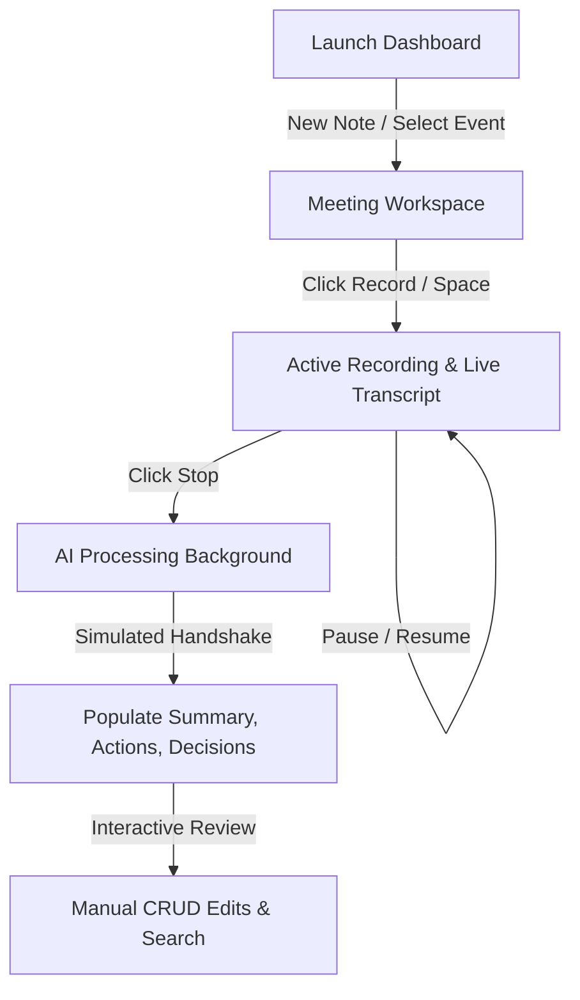

# Granola Desktop UX Analysis Report

This document outlines the product design patterns, layouts, workflows, and performance characteristics observed in the **Granola** reference video and maps them alongside the **Meetily** architectural references. It serves as the design and implementation blueprint for Mirai Granola.

---

## 1. Overall User Journey

- **First Launch Experience**: Clean, distraction-free home dashboard. The layout places "Today's schedule" prominently as a large card alongside "Recent Notes". If no accounts are synced, an elegant calendar connection card acts as the primary onboarding call-to-action.
- **Creating a New Note**: Clicking "New Note" (or pressing `Ctrl+N`) instantly opens the workspace. The note title defaults to a placeholder (e.g., "Untitled Note" or "Meeting at 10:30 AM") that dynamically updates when AI processes the session.
- **Joining a Meeting**: The user links their calendar; upcoming events show cards. Clicking "Record" on a card joins and names the session automatically based on the event title.
- **Recording Flow**: Starting a recording triggers:
  - Visual blinking indicators (e.g., a pulsing red ring).
  - Time elapsed counter in monospace font.
  - Live sound amplitude visualization.
  - Quick action controls: Pause, Resume, Stop, and Discard (X).
- **Live Transcription Flow**: Words stream in real-time. Speakers are clearly distinguished. Hover states or badges show timestamps.
- **AI Processing Flow**: Once the user stops recording, the application starts background analysis. A loading skeleton is shown, and the notes, summary, and action items populate asynchronously.
- **Ending the Meeting**: Concluding the session finalizes the audio WAV archive, ends the transcription websocket streams, and initiates summary prompts.
- **Reviewing Notes**: Users check summary highlights, tick completed action items, edit text inline, add custom items, and search the transcript.

---

## 2. Layout & Spacing

### 2.1 Sidebar Navigation
- **Hierarchy & Sizing**: Persistent left sidebar (`w-64`). High-contrast dark background (`bg-zinc-950` / `bg-black`).
- **Elements**: Brand logo, primary "New Note" button, navigation links (Home, History), setting links, and a quick-search input.
- **Active State**: Navigation selections use a subtle outline or solid gray background with white text, providing high readability.

### 2.2 Header area
- Display page titles, date/time subheaders, and context actions (e.g., "New Note" or "Delete Session") aligned with identical padding margins.

### 2.3 Split Meeting Workspace
- **Transcript Panel (Left, `col-span-7`)**: Large, readable column. Times and speaker labels use light colors (`text-zinc-500` / `text-zinc-400`) to let speech content stand out.
- **Notes & Actions (Right, `col-span-5`)**: Vertically stacked panels. The AI summary editor is allocated more height (`flex-[3]`) compared to action checkboxes (`flex-[2]`).
- **Breathing Room**: Standard padding gaps (`p-5` to `p-8`) with 20px cell margins. High readability is maintained even when panels stack on tablet or mobile widths.

---

## 3. Meeting Recording Workflow
- **Manual Start**: Recording is manual by default. The user selects their mic input, checks their levels via the visualizer, and clicks "Record".
- **Automatic Sync**: Connects to the local calendar. Joining a calendar meeting prompts the user to start recording.
- **Pause & Resume**: Pause halts the timer and transcription websocket stream, and dims the live level visualizer, avoiding recording off-topic banter.
- **Non-blocking Interaction**: Users can type manual note details in the editor during active recording without stopping the transcript feed.

---

## 4. Live Transcription Engine
- **Streaming Frequency**: Speech lines stream word-by-word (incremental updates).
- **Smart Auto-scroll**: If the user is reading earlier parts of the text (manual scroll up), the container locks. Once the user scrolls back to the bottom, auto-scrolling resumes.
- **Speaker Separation**: Consistent labels (e.g., "Speaker 1", "Nisha Shetty") with timecodes (`0:02`, `0:45`) placed inside badges to index dialogue sections.
- **Confidence Metrics**: Low-confidence phrases display slightly grayed out, turning solid when finalized.

---

## 5. AI Processing Timeline
- **Timing**: Heavy summary generation starts right after recording stops (non-incremental).
- **Feedback**: A pulsing loading skeleton block covers the editor panel, displaying progress status messages ("Summarizing transcript...", "Itemizing action items...").
- **UI Responsiveness**: The app stays active. Users can click other notes, browse settings, or write manual notes while the processing runs in the background.

---

## 6. Notes Experience
- **Editable Markdown Sections**: AI notes are formatted in markdown (Summary, Decisions, Follow-ups). Clicking inside the textbox converts it to a clean textarea input.
- **Keyboard Shortcuts**:
  - `Space`: Toggle Play/Pause when recorder control buttons have focus (bypassed inside text inputs).
  - `Ctrl+Shift+R`: Start/Stop Recording.
  - `Escape`: Cancel/Discard active recording.

---

## 7. Window Behavior & Responsiveness
- **Vertical Stretching**: A native desktop feeling is achieved by setting the container to `h-screen overflow-hidden` and letting each panel scroll internally. Double scrollbars are eliminated.
- **Collapsible Elements**: Columns transition from side-by-side (`grid-cols-12`) to stacked (`grid-cols-1`) on small laptop or tablet screens, retaining transcript readability and recorder button layouts.

---

## 8. Performance Characteristics
- **Background Workers**: heavy computations (WAV files compilation, SQLite logs indexing, LLM summaries calls) run asynchronously.
- **Sub-second Latencies**: Interface state updates are instant, with smooth CSS transition effects on hover states.

---

## 9. Design Philosophy
- **Lightweight & Premium**: Focus on minimalism. Monospace timers, light gray text limits visual noise, and rounded borders feel modern.
- **Branding**: Mirai Granola uses custom Outfit typefaces, Indigo gradients, and specific subheaders to establish its own identity.

---

## 10. Granola Features Comparison Matrix

| Feature Area | Granola Reference Behavior | Mirai Granola Status | Implementation Priority & Recommendation |
| :--- | :--- | :--- | :--- |
| **Monospace Timer & Visualizer** | моноspace timer ticking, 12-bar RMS decibel levels meter | ✅ Matches Granola | *Completed*. Live volume updates are hooked via script node analyzers. |
| **Smart Scroll Transcript** | Auto-scrolls on text input, freezes on user scroll-up | ✅ Matches Granola | *Completed*. Integrated container scroll heights listeners. |
| **Automatic AI Summarization** | Triggers summary & action extraction on stop | ✅ Matches Granola | *Completed*. Invokes provider extraction prompts in the background. |
| **Action Items CRUD** | Edit inline, check complete, delete and add custom | ✅ Matches Granola | *Completed*. Added list item text edit inputs and hover delete triggers. |
| **Dynamic Viewport Flexing** | Stretch to lock screen boundary, internal scrolling | ✅ Matches Granola | *Completed*. Extended layout with `fullHeight` props. |
| **Calendar Sync Interface** | Sync google calendar list, upcoming cards | ⚠ Needs Improvement | **Medium**. Sync calendar accounts dynamically using mock schedules databases. |
| **Audio Scrubber Playback** | Scrub timeline to play matching audio segments | ❌ Missing | **Low**. Package audio player overlays linking transcripts to WAV timestamps. |
| **Command Palette Search** | Quick command search modal (Raycast style) | ❌ Missing | **Low**. Build a modal lookup command overlay for routes and notes. |

---

## 11. Meetily Integration Assessment

| Meetily Module | Reusability Assessment | Integration Strategy for Mirai Granola |
| :--- | :--- | :--- |
| **WebSocket Audio Buffering** | ⚠️ Partial | Meetily uses Tauri web socket handlers. In Mirai Granola, we stream via the Web Audio API directly into `AIProvider.transcribeAudioChunk` calls. |
| **Sequence ID Ordering** | ✅ Highly Reusable | Adopted the Map-based buffer registry to sort transcripts by chronological sequence ID numbers in case of network latency. |
| **Auto-scroll Tracker** | ✅ Highly Reusable | Integrated the scroll position bounds checker (`scrollTop + clientHeight >= scrollHeight - 20`) to govern scroll locking. |
| **LLM Note Extraction** | ⚠️ Low | Meetily uses fixed local sidecars. Mirai Granola routes all prompts through the provider-agnostic `ProviderManager`. |

---

> [!IMPORTANT]
> This analysis serves as the blueprint for the remaining stages of the Mirai Granola desktop application development.
